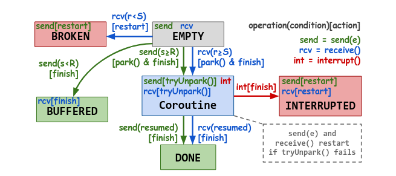
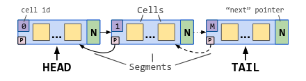
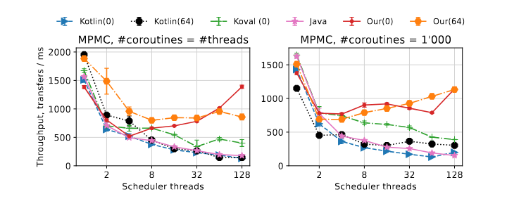

\renewcommand*\contentsname{Содержание} \tableofcontents

# Введение

Асинхронное программирование представляет собой классический подход, позволяющий изолировать выполнение отдельных участков кода от основного потока приложения. Данный подход наиболее эффективен при работе с задачами, характеризующимися высокой вариативностью задержек, такими как операции ввода-вывода(I/O) или обработка сетевых запросов.
Сопрограммы представляют собой общий и эффективный способ поддержки асинхронного программирования. Они могут приостанавливать(suspend) и 
возобновлять(resume) выполнение кода, тем самым обеспечивая кооперативную(невытясняющую) многозадачность. Программирование с использованием сопрограмм похоже на стандартное многопоточное программирование, с важным отличием, что сопрограммы являются легковесными, а также переиспользуют нативные потоки. За счёт переиспользования системных потоков и отличной реализации существенно улучшаются такие качественные характеристики, как максимальное количество сопрограмм и производительность блокировок. Это, в свою очередь, открывает новые компромиссы при дизайне и реализации примитивов синхронизации.

<br>

Основным примитивом синхронизации для сопрограмм служит рандеву-канал. Рандеву-канал представляет из себя блокирующую очередь с нулевой ёмкостью. Он поддерживает запросы на отправку(send(message)) и на получение(receive()) сообщений. Отправление сообщений проверяет наличие в очереди получателя, либо удаляет одного из них, либо добавляет себя, как ожидающего отправителя. Получение сообщений работает симметрично. Операции являются, умышленно, блокирующими. Рандеву-канал является основным примитивом синхронизации в асинхронном программировании, выступая в качестве основы для более сложных протоколов передачи сообщений.

<br>

Таким образом, отличная реализация рандеву-каналов может дать заметное улучшение производительности. В статье "Fast and Scalable Channels in Kotlin Coroutines"(Nikita Koval, Dan Alistarh, Roman Elizarov)`\cite{paper}`{=tex} предлагается эффективный алгоритм реализации рандеву-каналов с измерениями. 

# Конфигурация

Для управлениями сопрограммами будет использоваться следующий интерфейс:

::: listing
```
interface Coroutine {
    fun tryUnpark(): Boolean
    fun interrupt(): Unit
    fun park(onInterrupt: lambda () -> Unit): Unit
}

fun curCor(): Coroutine
```
Caption: интерфейс управления сопрограммами
:::

Функция `curCor` используется для получения текущей исполняющейся сопрограммы. Метод `park` используется для приостановления сопрограммы. Сопрограммы также могут быть отменены с помощью метода `interrupt`. В случае отмены приостановленной сопрограммы исполняется обработчик `onInterrupt`, переданный во время остановки. Для того, чтобы возобновить сопрограмму предоставляется метод `tryUnpark`, возвращающий `true` при успехе, `false` если сопрограмма была отменена. 

В системе предполагается наличие атомарных Compare-And-Swap(CAS) и Fetch-And-Add(FAA) инструкций. Алгоритм предлагается реализовать в среде выполнения с поддержкой сборки мусора. 


# Алгоритм

Предлагается реализовать рандеву-канал на основе структуры данных, называемой бесконечным массивом. Активный участок массива - скользящее окно, в ячейках которого могут хранится сообщения, сопрограммы и состояния операций. Позиция этого окна задаётся счётчиками выполненных отправок(`S`) и получений(`R`). В зависимости от положения счётчиков относительно друг друга, каждая операция приводит либо к блокировке с резервацией себе местав массиве, либо к "рандеву" с запросом противоположного типа. Предполагается, что каждый элемент массива будет обработан ровно одной отправкой и ровно одним получением. 

::: listing
```
class Channel<Message> {
    var S, R: Long
    var A: InfiniteArray<Waiter>
    fun send(element: Message) { ... }
    fun receive(): Message { ... }
}

struct Waiter<Message>(state: Any?, elem: Message?)
```
Caption: предложенная архитектура рандеву-канала
:::

S и R являются 64-битными счётчиками, содержащими количество соответственно отправок(S), получений(R). Предпологаем, что отправление сообщение производит рандеву с ожидающим получателем в случае S < R, блокирует в противном случае. Аналогично для получения сообщений. Массив A содержит заблокированные запросы. Каждый элемент представлен структурой `Waiter`: поле `state` содержит ожидающую сопрограмму, `elem` отправляемое сообщение.  

Операции начинают исполнение с увеличения соответствующего им счётчика с помощью FAA, резервируя себе место в массиве. Далее они считывают счётчик противоположного типа, определяя свои дальнейшие действия: блокироваться или совершать рандеву. Если противоположный счётчик больше чем счётчик данной операции совершается рандеву; в противном случае в соответствующий элемент массива устанавливается сопрограмма и блокируется.

Синхронизация операций производится на поле `state`. Конечный автомат представлен на рисунке 1. Отправление сообщений распологает сообщение в поле `elem` перед синхронизацией, после этого `receive` может его безопасно забрать.

Изначально каждый элемент находится в состоянии `EMPTY`(можно выразить, например, используя `null` в коде). После этого, операция, которая будет блокироваться, меняет элемент на ожидающую сопрограмму. После этого операция противоположного вида возобновляет сохранённую сопрограмму, затем меняет состояние ячейки на `DONE`.

Однако, операция, которая должна возобновлять сохранённую сопрограмму, могла начать обрабатывать элемент когда он был в `EMPTY`, если сопрограмма ещё не успела быть сохранена. В случае такой гонки стратегии для `send` и `receive` разнятся. `send` изменяет состояние на `BUFFERED`; операция знает, что получатель уже на подходе, а значит нет причин ждать. Получатель же забирает элемент и не блокируется.

К сожалению, подобная стратегия не работает для `receive`, так как `receive` не только должен возобновлять сохранённую сопрограмму, но и получать сообщение. Вместо этого операция "отравляет" ячейку, перемещая её в состояние `BROKEN`. Другие операции, находя ячейку в таком состоянии должны пропустить её и перезапустить работу. Стратегия перезапуска работы также применяется в случае, когда сопрограмма противоположной операции была отменена. В таком случае либо `tryUnpark` проваливается, либо ячейка уже находится в состоянии `INTERRUPTED`. В случае отмены операция должна изменить состояние ячейки на `INTERRUPTED`, чтобы избежать утечек памяти. Это можно сделать, к примеру, через механизм `onInterrupt`, являющийся параметром метода `park`.

::: figure


Caption: Диаграмма конечного автомата, используемого операциями для синхронизации
:::

## Отправление сообщений

Чтобы отправить элемент, операция сначала инкрементирует счётчик `S` с помощью `FAA`, получая значение перед инкрементом. Затем, помещает сообщение в `A[S]`, и, наконец, обновляет ячейку согласно диаграмме, изображённой на рисунке 1, используя метод `updCellSend`.

Функция `updCellSend` написана в виде автомата специально, чтобы быть консистентной с диаграммой. Логика функции исполняется в бесконечном цикле, получая значение обрабатываемой ячейки и счётчика `R` в начале функции.

Когда ячейка находится в состоянии `EMPTY`, а также `S >= R`(означая, что операция получателя ещё не приходит), операция решает заблокироваться. Таким образом, операция получает ссылку на текущую сопрограмму, обменивая её с `EMPTY` с помощью атомарной инструкции `CAS`, затем блокирует сопрограмму через `cor.park`. Если `CAS` проваливается, операция перезапускается. Операция успешно завершается после возобновления получателем. В альтернативном исходе событий операция `send` могла быть отменена; в таком случае будет исполнен обработчик, переданный параметром метода `park`, который переведёт клетку в состояние `INTERRUPTED`, а также очистит поле сообщения. 

Мы знаем, что когда клетка содержит сопрограмму, она ожидает `receive`, чтобы провести с ним рандеву. В таком случае `send` пытается возобновить сопрограмму, вызывая `tryUnpark`. При успехе состояние клетки переводится в `DONE`, а операция успешно завершается. Иначе, если получатель прерван, операция счищает сообщение, чтобы избежать утечки памяти, а после перезапускается. Такие же действия актуальны и когда операция находит клетку в состоянии `INTERRUPTED` или `BROKEN`.

\newpage 

::: listing
```kotlin
fun send(element: E) = while (true) {
  s := FAA(&S, +1) // reserve a cell
  A[s].elem = element
  if updCellSend(s): return
}
  // Returns `false ` if this ‘send(e)‘ should restart
fun updCellSend(s: Int): Bool = while (true) {
  state := A[s].state // read the current state
  r := R // read the receiver 's counter
  when {
   // Empty and no receiver is coming => suspend
   state == null && s >= r:
     cor := curCor() // get the current coroutine
     if CAS(&A[s].state, null, cor):
       cor.park( // wait for a rendezvous
         onInterrupt = {A[s] = (INTERRUPTED, null)})
       return true
   // Waiting receiver => try to resume it
   state is Coroutine:
     if state.tryUnpark():
       A[s].state = DONE ; return true
     else: // interrupted , clean the cell and fail
       A[s].elem = null ; return false
   // Empty but a receiver is coming => elimination
   state == null && s < r:
     if CAS (&A[s].state , null , BUFFERED ): return true
   // Interrupted receiver or poisoned => fail
   state == INTERRUPTED || state == BROKEN :
     A[s].elem = null // clean to avoid memory leaks
     return false
   }
 }
```
Caption: алгоритм для операции `send` 
:::

## Получение сообщений

Реализация операции `receive` является симметричной и обновляет состояние ячейки по диаграмме на рисунке 1. Отличиями является то, что `receive` помечает ячейку `BROKEN` в случае, когда она находится в состоянии `EMPTY`, но рандеву должно произойти, а также проверяет ячейку на состояние `BUFFERED`.

\newpage

::: {.listing placement="H"}
```
fun receive(): E = while (true) {
  r := FAA (&R , +1 ) // reserve a cell
  if updCellRcv (r):
    e := A[r].elem; A[r].elem = null; return e
}
// Returns `false ` if this ‘receive()‘ should restart
fun updCellRcv(r: Int): Bool = while (true) {
  state := A[r].state // read the current state
  s := S // read the sender 's counter
  when {
   // Empty and no sender is coming => suspend
    state == null && r >= s:
      cor := curCor () // get the current coroutine
      if CAS(&A[r].state, null, cor):
        cor.park( // wait for a rendezvous
          onInterrupt = {A[r].state = INTERRUPTED })
        return true
   // Waiting sender => try to resume it
    state is Coroutine:
      if state.tryUnpark():
        A[r].state = DONE ; return true
      else: // interrupted
        return false
   // Empty but a sender is coming => poison
    state == null && r < s:
      if CAS(&A[r].state, null, BROKEN): return false
      // An elimination has happened => finish
    state == BUFFERED: return true
     // Interrupted sender => fail
    state == INTERRUPTED: return false
  }
}
```
Caption: алгоритм для операции `receive`
:::

## Реализация структуры данных бесконечного массива

Идея реализации бесконечного массива лежит в использовании связного списка сегментов, каждый из которых содержит массив из `K` ячеек. Каждому из сегментов соответствует уникальный идентификатор(id), а также сегменты располагаются последовательно. В таком случае, для обращения к `i`-ой ячейке бесконечного массива необходимо найти сегмент с идентификатором `i / K`, затем перейдя к ячейке с индексом `i (mod K)`. Подобный список из сегментов можно реализовать на основе очереди Майкла и Скотта`\cite{papermichael}`{=tex} или же очереди Ladan-Mozes`\cite{paperladan}`{=tex}.

::: figure



Caption: Пример структуры данных бесконечного массива

:::


# Измерения

Данный алгоритм был реализован и интегрирован в стандартную библиотеку `Kotlin Coroutines`. Для сравнения производительности была использована стандартная реализация в библиотеке `Kotlin Coroutines`, а также алгоритмы Scherer`\cite{paper2}`{=tex}, и Koval`\cite{paper3}`{=tex}. 

## Окружение

Эксперименты запускались на сервере с 4 Intel Xeon Gold 5128 (Cascade Lakel) с 16-ядерными сокетами. Всего при запуске использовалось 128 потоков.

## Бенчмарки

Для сравнения производительности использовался классический паттерн производителя-потребителя: несколько сопрограмм используют один и тот же рандеву-канал, используя `send` и `receive` на нём. Используется одинаковое количество производителей и потребителей, оно либо равняется количеству потоков или является фиксированным числов до 1000. Замеряется время, необходимое для передачи 10^6 сообщений, а также пропускная способность. Также симулируется фоновая работа между операций: потребляется в среднем 100 итераций циклов(следуя геометрическому распределению), чтобы уменьшить конкуренцию за канал. 

## Результаты

Результаты измерений изображены на рисунке 2. Стоит заметить масштабируемость: в то время как пропускная способность остальных алгоритмов деградирует с увеличением количества потоков, предложенное решение продолжает масштабироваться.  

::: figure


Caption: результаты измерений
:::

## Отравленные ячейки

Также была собрана статистика, касающаяся количества отравленных(`BROKEN`) ячеек. Наблюдения показали, что оно никогда не превышает 10% от количества ячеек.

## Использование памяти

Дополнительно были собраны данные о давлении на выделение памяти. При низкой конкуренции рандеву-канал имеет такие же показатели как алгоритм Koval et al., т.к. они оба используют связный список сегментов. Синхронизированная очередь `Java` и стандартные механизмы в `Kotlin` показывают 40% и 115% больше накладных расходов соответственно. При высокой конкуренции предложенный алгоритм является наилучшим, в то время как остальные решения имеют расходы выше от 20% (`Java`) до 90% (`Kotlin`).

# Заключение

Предложенная реализация рандеву-каналов устраняет деградацию производительности и позволяет масштабировать передачу сообщений. У неё есть следующие достоинства:

- Алгоритм учитывает отмену сопрограмм.
- Алгоритм отлично масштабируется при конкуренции

Также можно заметить следующие слабости:

- Алгоритм явно рассчитывает на наличие сборки мусора в языке
- Отравленные состояния ячеек заставляют алгоритм перезапускаться, что делает задержку непредсказуемой.

\pagebreak
\renewcommand{\refname}{Список литературы}
\begin{thebibliography}{99}
\bibitem{paper} Nikita Koval, Dan Alistarh, Roman Elizarov.
   \emph{Fast and Scalable Channels in Kotlin Coroutines}.
\bibitem{paper2} William N Scherer III, Doug Lea, and Michael L Scott. 
   \emph{Scalable synchronous queues}.
\bibitem{paper3} Nikita Koval, Dan Alistarh, and Roman Elizarov.
   \emph{Scalable fifo channels for programming via communicating sequential processes}.
\bibitem{paperladan} Edya Ladan-Mozes, Nir Shavit.
   \emph{An optimistic approach to lock-free FIFO queues}
\bibitem{papermichael} Maged M. Michael, Michael L. Scott
   \emph{Simple, Fast, and Practical Non-Blocking and Blocking Concurrent Queue Algorithms}
\end{thebibliography}
